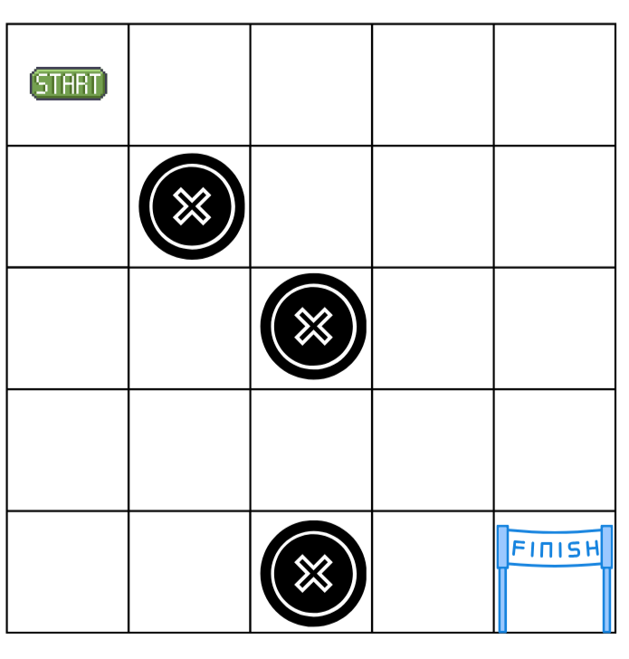

# Codigo de laberinto

## Problema
Se dispone de un tablero de 5×5 que representa un laberinto, en el cual existe una posición inicial, una posición objetivo o meta y varias casillas que funcionan como obstáculos o trampas. Un robot debe desplazarse dentro de este tablero avanzando una sola casilla por movimiento, pudiendo moverse únicamente en las direcciones arriba, abajo, izquierda o derecha, con el propósito de alcanzar la meta.

## Laberinto
{ width="40%"}

## Codigo
```C++
robot = [0,0]
inicio = (0,0)
fin = (4,4)
n = 5

laberinto = [
    [1, 0, 0, 0, 0],
    [0, -1, 0, 0, 0],
    [0, 0, -1, 0, 0],
    [0, 0, 0, 0, 0],
    [0, 0, -1, 0, 0]
]

def mostrar():
    for fila in laberinto:
        print(fila)
    print("-" * 20) 

def trampa(casilla):
    return casilla == -1

def mover_derecha(pos):
    for j in range(pos[1] + 1, n):
        if trampa(laberinto[pos[0]][j]):
            print("¡Trampa! Bloqueado a la derecha.")
            break
        
        laberinto[pos[0]][robot[1]] = 0
        
        robot[1] = j
        laberinto[pos[0]][robot[1]] = 1
        mostrar()

def mover_abajo(pos):
    for i in range(pos[0] + 1, n):
        if trampa(laberinto[i][pos[1]]):
            print("¡Trampa! Bloqueado abajo.")
            break
    
        laberinto[robot[0]][pos[1]] = 0
    
        robot[0] = i
        laberinto[robot[0]][pos[1]] = 1
        mostrar()

print("Posición inicial:", robot)
mostrar()

mover_derecha(robot)
mover_abajo(robot)
```