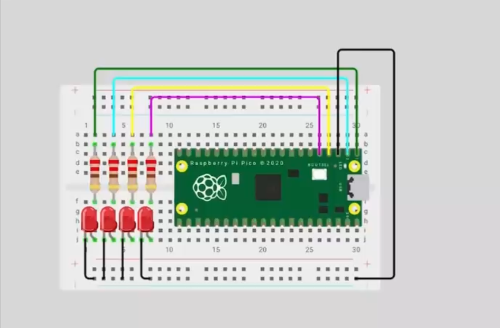

# Outputs basicos
 
## Contador binario 4 bits
### Que debe hacer
En cuatro leds debe mostrarse cad segundo la representacion binaria del 0 al 15
 
``` codigo
#include "pico/stdlib.h"
 
#define PIN_A 0
#define PIN_B 1
#define PIN_C 2
#define PIN_D 3
 
int main() {
 
   // Máscara
   const uint32_t MASK = (1u<<PIN_A) | (1u<<PIN_B) | (1u<<PIN_C) | (1u<<PIN_D);
 
   gpio_init_mask(MASK);
   gpio_set_dir_out_masked(MASK);
 
   while (true) {
       for (int i = 0; i < 16; i++) {   // Cuenta de 0 a 15
           gpio_put_masked(MASK, i << PIN_A);
 
           sleep_ms(1000);                  
       }
   }
}
```
## Esquemtico

 
 
## Video
 
<iframe width="560" height="315" src="https://www.youtube.com/embed/Man1uiNQgQg?si=1-MrveGR_90Mh2ag" title="YouTube video player" frameborder="0" allow="accelerometer; autoplay; clipboard-write; encrypted-media; gyroscope; picture-in-picture; web-share" referrerpolicy="strict-origin-when-cross-origin" allowfullscreen></iframe>
 
## Barrido de leds
### Que debe hacer
 
Correr un “1” por cinco LEDs P0..P3 y regresar (0→1→2→3→2→1…)
 
``` codigo
#include "pico/stdlib.h"
#include "hardware/structs/sio.h"
 
#define LED0 0
#define LED1 1
#define LED2 2
#define LED3 3
 
int main() {
   // Máscara
   const uint32_t MASK = (1u<<LED0) | (1u<<LED1) | (1u<<LED2) | (1u<<LED3);
 
   // Inicializar pines
   gpio_init(LED0);
   gpio_init(LED1);
   gpio_init(LED2);
   gpio_init(LED3);
 
   // Configurar como salida
   sio_hw->gpio_oe_set = MASK;
 
   int pos = 0;       // LED inicial
   int dir = 1;       // Dirección: 1→derecha, -1→izquierda
 
   while (true) {
       // Apagar todos
       sio_hw->gpio_clr = MASK;
 
       // Encender solo el LED actual
       sio_hw->gpio_set = (1u << pos);
 
       sleep_ms(200);
 
       // Mover posición
       pos += dir;
 
       // Rebotar en los extremos
       if (pos == 3) dir = -1;  
       if (pos == 0) dir = 1;
   }
}
```
## Esquemtico

 
 
## Video
<iframe width="560" height="315" src="https://www.youtube.com/embed/crPhcQlOhkA?si=fEG9RoWUUCJGJQFm" title="YouTube video player" frameborder="0" allow="accelerometer; autoplay; clipboard-write; encrypted-media; gyroscope; picture-in-picture; web-share" referrerpolicy="strict-origin-when-cross-origin" allowfullscreen></iframe>