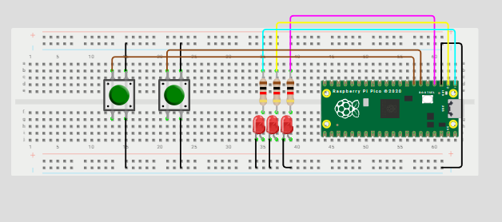
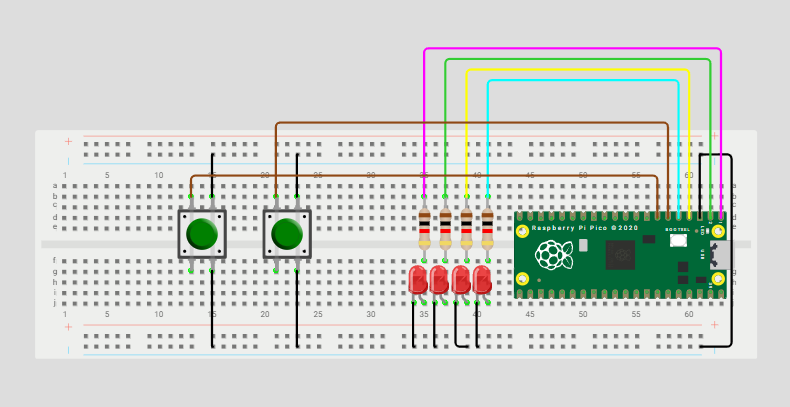

# Inputs

## Compuertas básicas AND / OR / XOR con 2 botones
### Qué debe hacer
Con dos botones A y B (pull-up; presionado=0) enciende tres LEDs que muestren en paralelo los resultados de AND, OR y XOR. En el video muestra las 4 combinaciones (00, 01, 10, 11).

``` codigo
#include "pico/stdlib.h"

#define BTN_A   5   
#define BTN_B   4   
#define LED_AND 0   
#define LED_OR  1   
#define LED_XOR 2   

int main() {
    
    const uint32_t BTN_MASK = (1u << BTN_A) | (1u << BTN_B);
    const uint32_t LED_MASK = (1u << LED_AND) | (1u << LED_OR) | (1u << LED_XOR);

    gpio_init_mask(BTN_MASK | LED_MASK);
    gpio_set_dir_out_masked(LED_MASK);  
    gpio_set_dir_in_masked(BTN_MASK);   
    gpio_pull_up(BTN_A);
    gpio_pull_up(BTN_B);

    while (true) {
        
        int a = !gpio_get(BTN_A);
        int b = !gpio_get(BTN_B);

        
        int val_and = a & b;
        int val_or  = a | b;
        int val_xor = a ^ b;

        
        uint32_t leds = (val_and << LED_AND) | (val_or << LED_OR) | (val_xor << LED_XOR);

        gpio_put_masked(LED_MASK, leds);

        sleep_ms(20);
    }
}
```
## Esquematico


## Video 
<iframe width="560" height="315" src="https://www.youtube.com/embed/3kYsAk8cVfE?si=u0389eEojDJMeK3b" title="YouTube video player" frameborder="0" allow="accelerometer; autoplay; clipboard-write; encrypted-media; gyroscope; picture-in-picture; web-share" referrerpolicy="strict-origin-when-cross-origin" allowfullscreen></iframe>

## Selector cíclico de 4 LEDs con avance/retroceso
### Qué debe hacer
Con dos botones A y B (pull-up; presionado=0) enciende tres LEDs que muestren en paralelo los resultados de AND, OR y XOR. En el video muestra las 4 combinaciones (00, 01, 10, 11).

``` codigo
#include "pico/stdlib.h"
 
#define LED0 0
#define LED1 1
#define LED2 2
#define LED3 3
#define B_AV 4
#define B_RE 5
 
int main() {
    // Máscara
    const uint32_t LEDS_MASK = (1u<<LED0) | (1u<<LED1) | (1u<<LED2) | (1u<<LED3);
 
    gpio_init(LED0);
    gpio_init(LED1);
    gpio_init(LED2);
    gpio_init(LED3);
    gpio_set_dir(LED0, true);
    gpio_set_dir(LED1, true);
    gpio_set_dir(LED2, true);
    gpio_set_dir(LED3, true);
 
    gpio_init(B_AV);
    gpio_init(B_RE);
    gpio_set_dir(B_AV, false);
    gpio_set_dir(B_RE, false);
    gpio_pull_up(B_AV);
    gpio_pull_up(B_RE);
 
    int pos = 0;        
    int estadoAV = 1;   // Estado previo botón A
    int estadoRE = 1;   // Estado previo botón B
 
    while (true) {
     
        gpio_put_masked(LEDS_MASK, (1u << pos));
 
        if (gpio_get(B_AV) == 0 && estadoAV == 1) {
            pos++;
            if (pos > 3) pos = 0;
        }
        else if (gpio_get(B_RE) == 0 && estadoRE == 1) {
            pos--;
            if (pos < 0) pos = 3;
        }
        // Guardar estado
        estadoAV = gpio_get(B_AV);
        estadoRE = gpio_get(B_RE);
 
        sleep_ms(20);
    }
}
```
## Esquematico


## Video 

<iframe width="560" height="315" src="https://www.youtube.com/embed/tVQgv4xvnJc?si=f9M6IhCKlwHLMtzb" title="YouTube video player" frameborder="0" allow="accelerometer; autoplay; clipboard-write; encrypted-media; gyroscope; picture-in-picture; web-share" referrerpolicy="strict-origin-when-cross-origin" allowfullscreen></iframe>