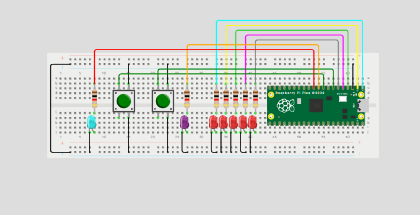

# Interruptores
## Qué debe hacer
 
Programar un mini-Pong con 5 LEDs en línea y 2 botones usando interrupciones (ISR) para registrar el “golpe” del jugador exactamente cuando la “pelota” (un LED encendido) llega al extremo de su lado.
 
**Reglas del juego**
 
1. Pelota: es un único LED encendido que se mueve automáticamente de un extremo al otro (L1→L5→L1…) a un ritmo fijo.
 
2. Golpe con ISR: cada botón genera una interrupción.
 
    * El BTN_L solo cuenta si, en el instante de la ISR, la pelota está en L1.
 
    * El BTN_R solo cuenta si, en el instante de la ISR, la pelota está en L5.
 
    - Si coincide, la pelota rebota: invierte su dirección.
 
    - Si no coincide (la pelota no está en el último LED de ese lado), el botón se ignora.
 
3. Fallo y punto: si la pelota alcanza L1 y no hubo golpe válido del lado izquierdo en ese momento, anota el jugador derecho. Análogamente, si alcanza L5 sin golpe válido, anota el jugador izquierdo.
 
4. Indicador de punto: al anotar, se parpadea el LED de punto 3 veces del jugador que metió el punto .
 
5. Reinicio tras punto: después del parpadeo, la pelota se reinicia en el centro (L3) y comienza a moverse hacia el jugador que metió el punto.
 
6. Inicio del juego: al encender, la pelota inicia en L3 y no se mueve hasta que se presione un boton y debera moverse a la direccion opuesta del boton presionado.
 
``` codigo
#include "pico/stdlib.h"
 
#define LED_1 0
#define LED_2 1
#define LED_3 2
#define LED_4 3
#define LED_5 4
 
//Jugadores
#define LED_J1 5
#define LED_J2 6
 
#define BTN_D 8 // Botón derecho
#define BTN_I 7 // Botón izquierdo
 
// Estado de la pelota
int led_on = LED_3;
int direc = 0;
 
int boton_d = 0;
int boton_i = 0;
 
 
void botones_dir(uint gpio, uint32_t events) {
    if (gpio == BTN_D) boton_d = 1;
    if (gpio == BTN_I) boton_i = 1;
}
 
// Led ganador
void parpadeo(int led) {
    for (int i = 0; i < 3; i++) {
        gpio_put(led, 1);
        sleep_ms(300);
        gpio_put(led, 0);
        sleep_ms(300);
    }
}
 
void init_pins() {
    for (int i = LED_1; i <= LED_5; i++) {
        gpio_init(i);
        gpio_set_dir(i, true);
    }
 
    gpio_init(LED_J1);
    gpio_set_dir(LED_J1, true);
    gpio_init(LED_J2);
    gpio_set_dir(LED_J2, true);
 
    gpio_init(BTN_D);
    gpio_set_dir(BTN_D, false);
    gpio_pull_up(BTN_D);
    gpio_init(BTN_I);
    gpio_set_dir(BTN_I, false);
    gpio_pull_up(BTN_I);
 
    gpio_set_irq_enabled_with_callback(BTN_D, GPIO_IRQ_EDGE_FALL, true, &botones_dir);
    gpio_set_irq_enabled_with_callback(BTN_I, GPIO_IRQ_EDGE_FALL, true, &botones_dir);
}
 
int main() {
    stdio_init_all();
    init_pins();
 
    while (direc == 0) {
        gpio_put(LED_3, 1);
        if (boton_d) { direc = -1; boton_d = 0; } // Empieza botón derecho
        if (boton_i) { direc = +1;  boton_i = 0; } // Empieza botón izquierdo
        sleep_ms(100);
    }
 
    while (true) {
   
        for (int i = LED_1; i <= LED_5; i++) gpio_put(i, 0);
        gpio_put(led_on, 1);
        sleep_ms(800); // Velocidad
 
        if (led_on == LED_1) {
            if (boton_d) { direc = 1; }
            else { parpadeo(LED_J2); led_on = LED_3; direc = 1; } // Punto jugador derecho
            boton_d = 0;
        }
        else if (led_on == LED_5) {
            if (boton_i) { direc = -1; }
            else { parpadeo(LED_J1); led_on = LED_3; direc = -1; } // Punto jugador izquierdo
            boton_i = 0;
        }
 
        // Mover pelota
        led_on += direc;
 
        // Limite
        if (led_on < LED_1) led_on = LED_1;
        if (led_on > LED_5) led_on = LED_5;
    }
}
 
```
## Esquemático

 
## Video
<iframe width="560" height="315" src="https://www.youtube.com/embed/27hgnbmd6Wk?si=w_6thkJ4J-pCuQ-1" title="YouTube video player" frameborder="0" allow="accelerometer; autoplay; clipboard-write; encrypted-media; gyroscope; picture-in-picture; web-share" referrerpolicy="strict-origin-when-cross-origin" allowfullscreen></iframe>